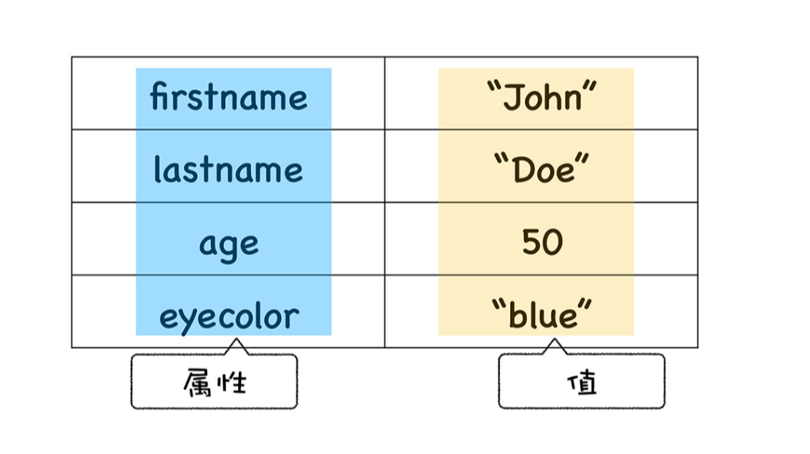
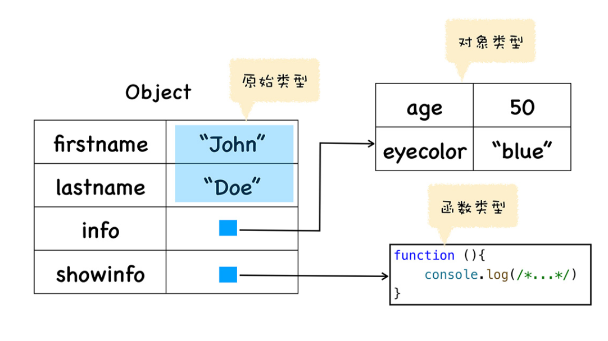
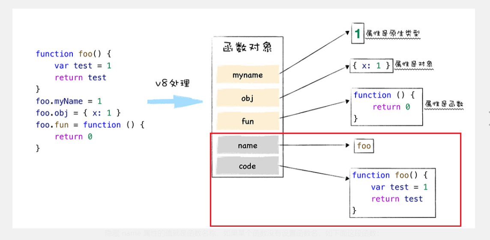

# 二.JS函数的特点

[TOC]

> - 在JavaScript中，函数就是一种特殊的对象
> - 在JavaScript中，函数被称为一等公民

## 1. 什么是JavaScript中的对象

1. **JavaScript 是一门基于对象的语言**
   - JavaScript中大部分的内容都是由对象构成的，比如函数，数组，对象等

2. **JavaScript是基于对象设计的，但是它却不是一门面向对象的语言**

   - 面向对象的语言天生支持封装，继承，多态

   - JavaScript除了通过原型链实现继承外，并不支持封装和多态

3. **JavaScript中的对象**

   - JavaScript中的对象是由一组属性和值构成的集合

   

   - JavaScript中对象的值可以是任意类型

   

## 2. 函数的本质

> 上面提到过，函数是一种特殊的对象，它和对象一样可以拥有属性和值
>
> 与对象不同的是，函数可以被调用

### 2.1 函数

~~~js
//函数的对象性
function bar(){
    var name = '马小飞'
}

bar.name = '月月飞'
console.log(bar.name)	//月月飞

//函数被调用的特殊性
function foo(){
    var name = 'maxiaofei'
    console.log(name)
}
foo()

//匿名函数
(function(){
    var name = 'maxiaofei'
    console.log(name)
})()
~~~

### 2.2 V8实现函数可调用性的方法

> 在V8内部，会为函数添加两个隐藏属性

也就是说，除了基本属性之外，V8还为函数新增了两个隐藏属性，分别是 code 和 name

- code 是函数调用,也就是执行该函数的代码，每次需要执行该函数的时候，实际上就是执行的code里面的代码

- name就是函数名，如果是匿名函数，没有设置函数名，则name属性的值就是 anonymous

## 3. 为什么说函数是一等公民

> 上面说过，函数是一种特殊的对象，所以在JavaScript中，函数可以当作变量来进行传递，也可以作为函数的入参，函数的返回值

来看下面一组代码

~~~js
function foo(){
    var num = 1;
    function bar(){
        num++;
        console.log(num)
    }
    return bar
}

var myFunc = foo();
myFunc()
~~~

JavaScript代码执行的时候，会维护一个作用域链，函数会顺着作用域链从内到外去寻找使用到的某个变量，当函数作为返回值返回并且赋值给另一个变量之后，由于该返回的函数依然被外部变量引用，外层函数内部空间不会被销毁，因为返回函数中包含对外层函数的引用（闭包）。这也正是函数是一等公民的体现点。

## 4. 总结

- 函数是一种特殊的对象，所以和对象一样，JavaScript中的函数也是由一组属性和值组成的集合
- JavaScript中函数不同于对象的点是，函数可以被调用
- V8实现函数的原理是，为函数对象生成两个隐藏的属性 name 和 code，分别代表函数名和函数调用代码，当函数被调用的时候，执行隐藏的code函数代码
- 由于JavaScript的存在调用栈和作用域链，当函数被当作返回值返回的时候，函数的执行上下文会依然保留，只要该函数存在被某变量引用，它的作用域就不会被销毁
- 函数被称为一等公民主要是由于以下两点
  1. 函数作为特殊对象的灵活性
  2. 函数闭包的特性