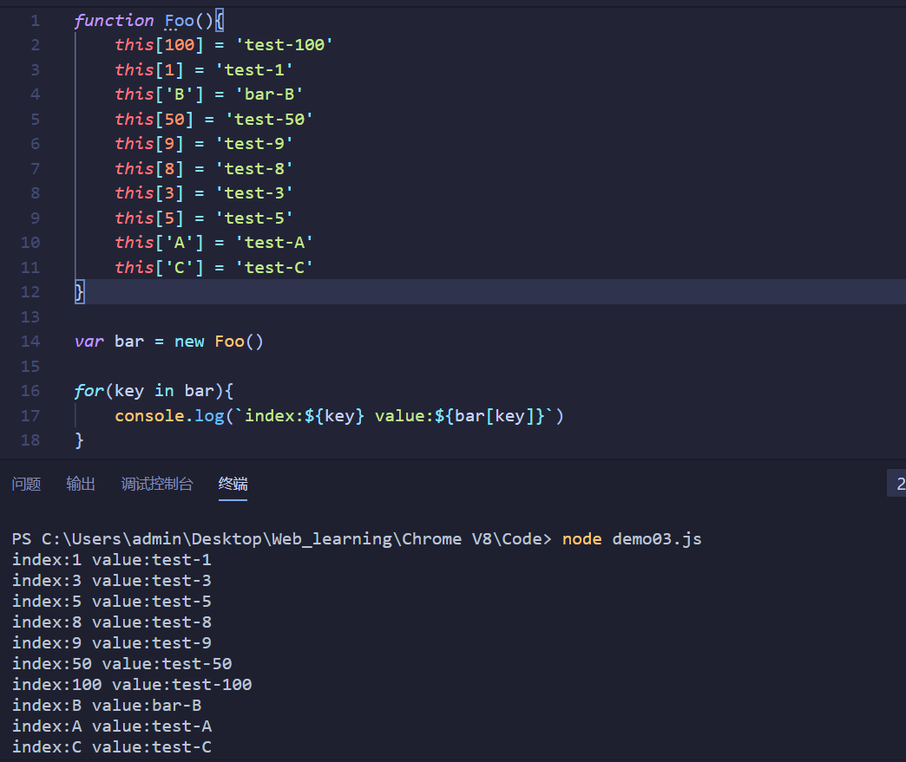
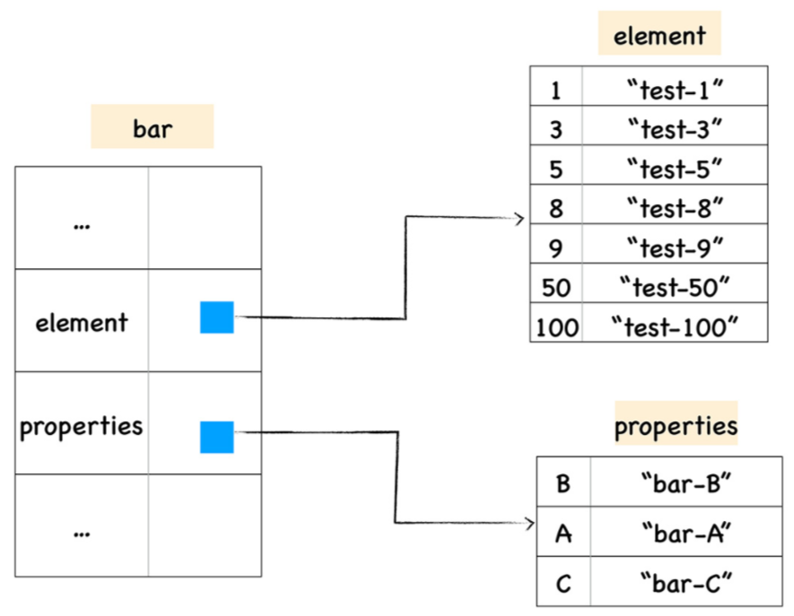
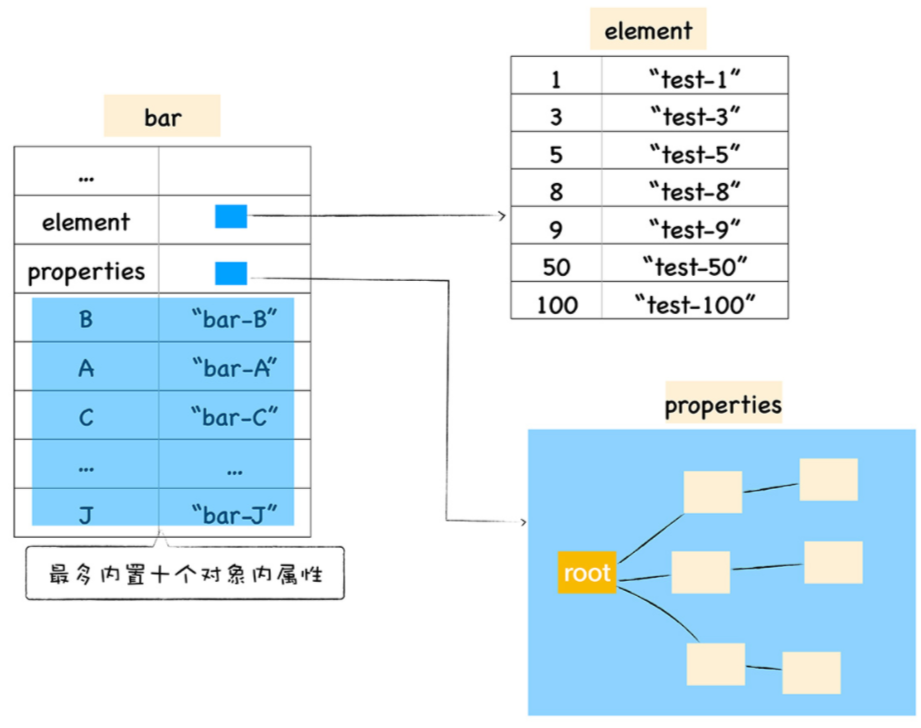
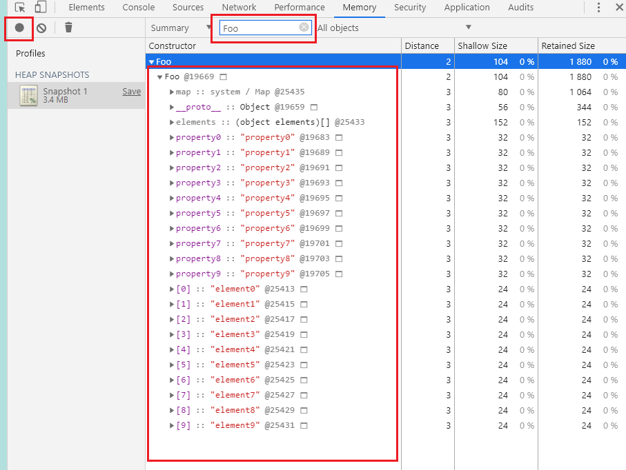

# 三. V8中对象处理详解

[TOC]

## 1. 常规属性和排序属性

**先给出一个定义**

> 在ES规范中定义了，数字属性应该按照索引值大小升序排列，字符串属性根据创建时的顺序升序排列

然后我们来看这么一段代码

~~~js
function Foo(){
    this[100] = 'test-100'
    this[1] = 'test-1'
    this['B'] = 'bar-B'
    this[50] = 'test-50'
    this[9] = 'test-9'
    this[8] = 'test-8'
    this[3] = 'test-3'
    this[5] = 'test-5'
    this['A'] = 'test-A'
    this['C'] = 'test-C'
}

var bar = new Foo()

for(key in bar){
    console.log(`index:${key} value:${bar[key]}`)
}
~~~

:question: 这段代码会打印什么

:key: **执行结果分析**

- 数字属性优先被打印出来了，且是按照从小到大的顺序
- 字符串属性依然按照声明的顺序打印的，打印顺序没有发生变化

**V8中两种属性的处理方法**

> 在这里我们把数字属性称为**排序属性**，在V8中被称为 **elements**
>
> 字符串属性被称为 **常规属性**，在V8中被称为 **properties**
>
> 在V8内部，为了有效提升存储和访问这两种属性的性能，分别使用了两个线性数据结构来分别保存排序属性和常规属性。
>
> - elements 和 properties都是对象的隐藏属性，外部不可直接调用
> - elements中的属性是按照大小顺序排列的，properties中的属性是按照创建时的顺序排列的
> - :balloon: 每次执行索引操作的时候，V8会先从elements属性中按照顺序读取所有的元素，然后再在properties中读取所有的元素

## 2. 快属性和慢属性

> **存在的问题：**
>
> 上面我们知道了，V8为js对象定义了 elements 和 properties两个隐藏属性，分别用来存储排序属性和常规属性，这就导致了在通过对象查找某个属性的时候，需要先找到 elements 或者 properties属性，然后在该属性中查找对应的值，增加的这一步查找操作，会影响元素的查找效率。
>
> **V8的解决方案：**
>
> 针对上述问题，V8的解决方案是将常规属性直接存储到对象本身。这类属性又被称为 **对象内属性**
>
> 当对象的属性被调用的时候，V8就会直接从对象本身去获取该值就可以了，少了一个查找的步骤，增加了查找效率
>
> **注：对象内属性的数量是固定的，默认是10个，如果添加的属性超出了对象分配的空间，则它们将会被保存在常规属性中**

### 2.1 快属性

> 保存在线性数据结构（elements，properties）中的属性被称为快属性，线性结构访问速度较快。
>
> 缺点：在线性结构中添加和删除属性时，效率比较低

### 2.2 慢属性

> 如果一个对象的属性过多，V8会采取另外一种存储策略，慢属性
>
> 慢属性对象内部有独立的非线性数据结构（字典）作为属性存储容器，所有的属性直接保存在属性字典中

## 3. 在Chrome中查看对象布局

> 这一小节主要是介绍在Chrome中查看对象布局的方法

### 3.1 在Chrome控制台输入如下代码

~~~js
function Foo(property_num,element_num) {
//添加可索引属性
for (let i = 0; i < element_num; i++) {
this[i] = `element${i}`
}
//添加常规属性
for (let i = 0; i < property_num; i++) {
let ppt = `property${i}`
this[ppt] = ppt
}
}
var bar = new Foo(10,10)
~~~

### 3.2 在Chrome调试中选择Memory

### 3.3 结果分析

> 此时对象布局是这样的
>
> - 10个排序属性存储在 elements中
> - 10个常规属性存储在 对象内属性

### 3.4 拓展

> **将对象属性个数调整至20个**
>
> - 10个排序属性存储在 elements中
> - 10个属性存储在 对象内
> - 10个常规属性以线性结构存放在 properties中
>
> **将对象属性个数调整至100个**
>
> - 10个排序属性存储在 elements中
> - 10个属性存储在 对象内
> - 90个常规属性以非线性字典结构存放在 properties中

## 4. 其它属性

除了 elements 和 properties 属性，V8还为每个对象实现了 `_proto_ ` 和 `map` 属性

`_proto_` ：原型，用来实现js对象的继承

`map`：隐藏类，后续介绍

## 5.总结

1. ES对象中区分了数字属性（排序属性）和字符串属性（常规属性），通过索引查找某个值的时候，会先遍历排序属性
2. V8为了提升查找效率，定义了快属性和慢属性，分别处理不同属性数量级的对象
   - 对象内属性最多只能有十个
   - 使用线性结构存储属性和非线性结构存储数据是快属性和慢属性的区别
   - 超过十个的常规属性会被存储到线性结构的 properties中
   - 如果对象的属性很多，V8会使用非线性解构的字典来存储常规属性
   - 线性结构查找快，新增和删除慢
3. 可以通过Chrom调试台的Memory来查看对象存储详情和布局