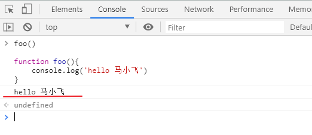
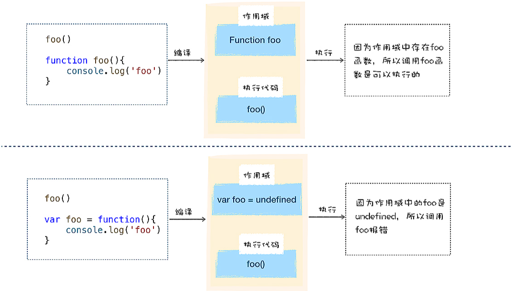

# 04. V8中的函数

[TOC]

## 1. 函数声明和函数表达式的差异

> 我们先来看一下什么是函数声明，什么是函数表达式

> 来看下面两段代码

- 函数声明

~~~js
foo()

function foo(){
    console.log('hello 马小飞')
}
~~~

- 函数表达式

~~~js
foo()

var foo = function(){
    console.log('hello 马小飞')
}
~~~

如果执行这两段代码，分别会返回什么？结果如下

**结论：**

- 使用函数声明定义的函数，可以在定义之前使用，函数的声明会被提升
- 使用函数表达式定义的函数，不存在函数提升，只有在赋值之后，才能被调用

**执行原理如下**

## 2. V8处理函数声明的方法

> V8在执行JavaScript的过程中，会线对其进行编译，然后再执行

看如下一段代码

~~~js
console.log(a)	// -> undefined
foo();			// -> hello world
let a = 10;
function foo(){
    console.log('hello world!')
}
~~~

不熟悉JavaScript的人看到这里可能会很懵，明明声明在调用之后，为什么会是这个执行结果

前面我们说了，V8在执行JavaScript代码之前，会先进行编译，编译的过程做了哪些事呢？

- 编译过程中，遇到变量声明，会将变量声明方法哦作用域中去，但是该变量的值为undefined
- 遇到函数声明，同样会放入作用域中去

到执行阶段的时候，如果使用了某个变量或者函数，V8会去作用域中查找相关内容，由于在编译阶段变量和函数都被放到了作用域，自然也就能获取到所有定义的变量和函数声明了

**变量提升：类似于这种，在编译阶段将所有的变量提升到作用域的过程称为变量提升**

**总结：**

- V8在解析JavaScript源码过程中，如果遇到变量声明，那么会讲变量提升到作用域中，变赋值为 `undefined` ,如果遇到函数声明，那么V8会在内存中声明函数对象，并将该对象提升到作用域中去。

## 3. V8处理函数表达式

> 在第二小节中我们明白了变量提升，即在执行JavaScript代码之前，所有变量和函数声明都会被提升到作用域，

我们再来看一下函数表达式的代码形式

~~~js
ler foo = function(){
    console.log('hello 马小飞')
}
~~~

有没有很眼熟，就类似于我们JavaScript中普通的变量声明和赋值语句

函数在运行的时候才会被赋值给foo变量，所以在赋值语句之前通过foo调用函数就类似于如下代码，当然会报错

~~~js
undefined()
~~~

## 4. 立即执行函数（IIFE）

> 前面我们知道了，JavaScript在编译阶段，并不会处理函数表达式
>
> 立即执行函数，正是利用了这个原理

**基本的立即执行函数**

~~~js
// demo_01
(function (){
    console.log('马小飞最帅！')
})（）

//demo_02
var a = (function(10){
    return a * 10
})(10)
// -> a = 100
~~~

**立即执行函数的优点**

- 不会污染作用域，变量在函数里面私有化，避免重名等问题
- 不会被外部环境访问到，有点像一次性代码，执行完即销毁

## 5. 总结

- V8执行JavaScript的过程是先编译，后执行
- JavaScript的变量提升发生在编译阶段，所有的变量声明和函数声明都会被提升到作用域
- 函数声明和函数表达式最大的区别就是函数声明会在编译阶段被提升到作用于中去，函数表达式只有在代码执行之后才可以通过变量调用
- 立即执行函数可以用来封装一些变量，函数，在实际工作用应用广泛。最大的优点就是不会污染作用域，具有一次性执行的效果