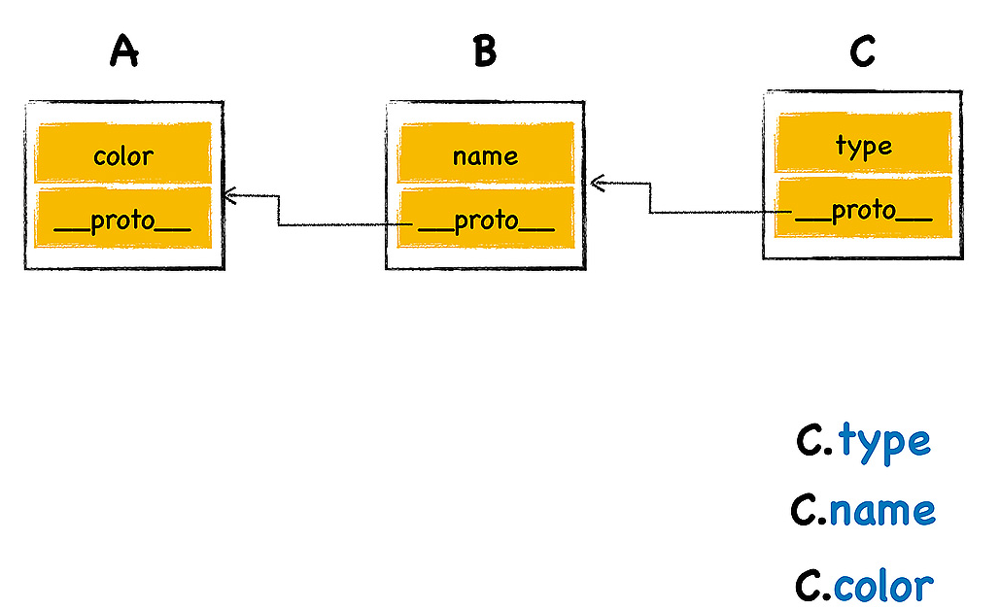
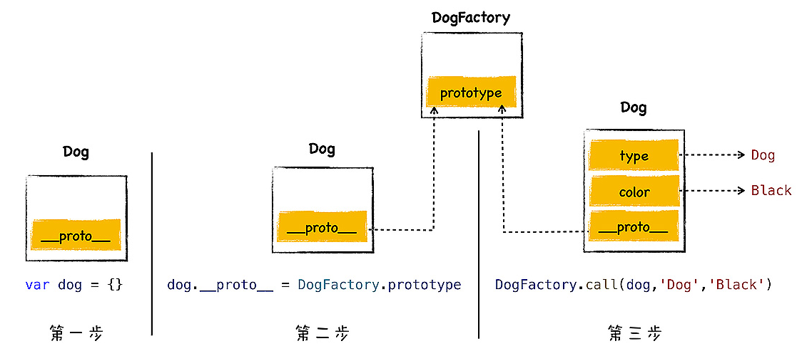

# 五. V8中的原型链

[TOC]

> **什么是继承？**
>
> 继承就是一个对象可以访问另一个对象中的属性和方法
>
> **最典型的两种继承实现方法**
>
> 1. 基于类的设计：Java，C++，C#
> 2. 基于原型继承：JavaScript

## 1. 原型继承的实现

在第三节，V8中的对象处理中我们说过，每个JavaScript对象多有一个隐藏的属性 `_proto_`

`_proto_` 属性又称为 **对象的原型**，该属性指向另外一个对象，一般把该属性指向的对象称为 **原型对象**

在对象中访问某个属性的时候，会优先在对象内部查找，如果找不到，则会去该对象原型对象中查找，找到之后即可以当作自己的属性使用

如图，C对象的原型对象是B对象，B对象的原型对象是Ａ对象，即C继承B，B继承A

- **当C对象获取 `type` 属性的时候**，在C对象内部就能找到，直接返回

- **C对象获取 `name` 属性的时候**，在C对象内部找不到，则在C的原型对象B中查找，找到name属性，直接调用

- **C对象获取 `color` 属性的时候**，也是通过原型链，找到A中的color属性，最后返回

**总结：** 继承就是一个对象可以访问另一个对象中的属性和方法，在JavaScript中，通过原型和原型链的方式来实现了继承

## 2. 使用构造函数创建对象

> 首先我们看一个实例，然后再来分析

~~~js
function DogFactory(type,color){
    this.type = type
    this.color = color
}

var dog = new DogFactory('Dog','red')
~~~

V8在执行这段代码时，做了如下几件事情

~~~js
//1.创建空的对象
var dog = {}
//2.将空的对象的原型指向DogFactory的原型对象
dog._proto_ = DogFactory.prototype
//3.使用call函数，使DogFactory中的this指向dog，初始化type和color
DogFactory.call(dog,'Dog','red')
~~~

如上三个步骤，就是通过构造函数创建对象的原理

## 3. 使用构造函数实现继承

