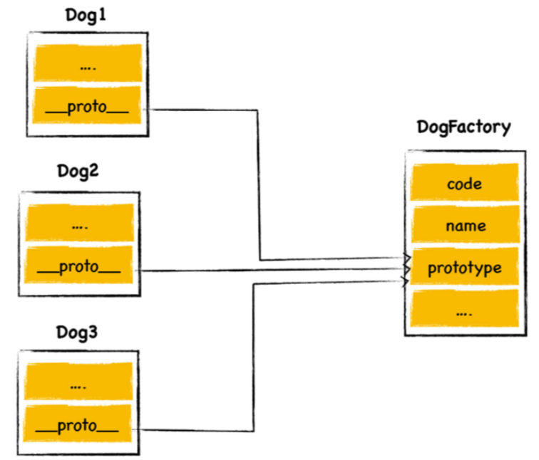

# 五. V8中的原型链

[TOC]

> **什么是继承？**
>
> 继承就是一个对象可以访问另一个对象中的属性和方法
>
> **最典型的两种继承实现方法**
>
> 1. 基于类的设计：Java，C++，C#
> 2. 基于原型继承：JavaScript

## 1. 原型继承的实现

在第三节，V8中的对象处理中我们说过，每个JavaScript对象多有一个隐藏的属性 `_proto_`

`_proto_` 属性又称为 **对象的原型**，该属性指向另外一个对象，一般把该属性指向的对象称为 **原型对象**

在对象中访问某个属性的时候，会优先在对象内部查找，如果找不到，则会去该对象原型对象中查找，找到之后即可以当作自己的属性使用

如图，C对象的原型对象是B对象，B对象的原型对象是Ａ对象，即C继承B，B继承A

- **当C对象获取 `type` 属性的时候**，在C对象内部就能找到，直接返回

- **C对象获取 `name` 属性的时候**，在C对象内部找不到，则在C的原型对象B中查找，找到name属性，直接调用

- **C对象获取 `color` 属性的时候**，也是通过原型链，找到A中的color属性，最后返回

**总结：** 继承就是一个对象可以访问另一个对象中的属性和方法，在JavaScript中，通过原型和原型链的方式来实现了继承

## 2. 使用构造函数创建对象

> 首先我们看一个实例，然后再来分析

~~~js
function DogFactory(type,color){
    this.type = type
    this.color = color
}

var dog = new DogFactory('Dog','red')
~~~

V8在执行这段代码时，做了如下几件事情

~~~js
//1.创建空的对象
var dog = {}
//2.将空的对象的原型指向DogFactory的原型对象
dog._proto_ = DogFactory.prototype
//3.使用call函数，使DogFactory中的this指向dog，初始化type和color
DogFactory.call(dog,'Dog','red')
~~~

如上三个步骤，就是通过构造函数创建对象的原理

## 3. 使用构造函数实现继承

> 在 04.V8中的函数中，我们介绍过，每个函数都有两个隐藏属性，name 和 code，但其实函数还有第三个隐藏属性 `prototype`
>
> `prototype` 是函数的原型对象，指向一个包含 `construtor` 和 `_proto_` 的对象，`constructor` 就是构造函数本身，`_proto_` 属性一般指向 `Object` 对象，所有的原型最终都指向 `Object` 对象

来看如下代码

- dog1，dog2，dog3都继承DogFactory
- 将共同的属性 voice 提取到原型对象中，所有继承DogFactory的对象都可以使用
- 三个对象的原型对象都指向DogFactory.prototype

~~~js
function DogFactory(type,color){
    this.type = type
    this.color = color
}

// 共同属性，提取到原型对象中共用
DogFactory.prototype.voice = '汪汪~'
var dog1 = new DogFactory('西班牙斗牛犬','Black')
var dog2 = new DogFactory('柯基','white')
var dog2 = new DogFactory('哈士奇','Black and white')
~~~

## 4. 关于new的历史

使用过Java语言的都知道，在Java中声声明一个对象的方式是这样的

`World myWorld = new World()`

JavaScript中并没有类的概念，且JavaScript跟Java语言天差万别，为什么会使用同一个关键字来创建对象呢？

答案是蹭热度，在JavaScript出生那个年代，Java已经非常火了，JavaScript为了搭上Java热度的顺风车，同时为了进一步吸引Java程序员参与到JavaScript项目里面来，就强生生的使用了new关键字来创建对象，同时取了这个看起来就像Java的弟弟名字，JavaScript

做法虽然很傻，但是确实达到了他的目的，通过这种方式取得了一定的成功

## 5. 总结

1. 在JavaScript中，每个对象都有一个 `_proto_` 属性，该属性指向另外一个对象，指向的对象被称为原对象的原型对象
2. JavaScript对象在调用自己的属性的时候，首先会在自身查找该属性，如果找不到，则会去原型对象中继续查找，最多会找到 Object对象，Object对象是所有对象的最终原型对象
3. 在JavaScript中如果需要使用继承，一般使用构造函数来创建对象，使用构造函数创建对象的原理如下
   - 创建一个空的对象：`let o = {}`
   - 将空对象的 `_proto_`属性指向构造函数的 `prototype` 原型对象：`o._proto_ = Father.prototype`
   - 通过call函数，将空对象绑定到构造函数的this，初始化属性：`Father.call(o,attr1,arrt2)`
4. JavaScript的名字由来，以及JavaScript中 new 关键字的由来，都是因为在JavaScript诞生之初，蹭Java热度

，