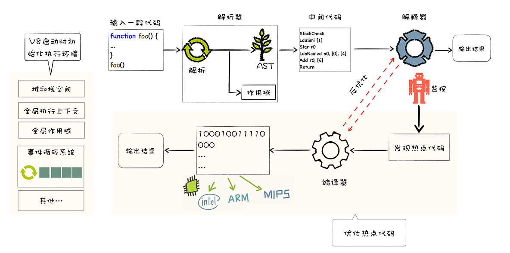

# 图解Google V8学习笔记

[TOC]

## 一. 走进Google V8

### 1. 什么是V8？

- Google开发的，开源的，JavaScript引擎
- V8也被称为 JavaScript 的虚拟机
- 功能：执行JavaScript代码

2. 计算机执行高级语言的两种方式

**1. 解释执行**

- 将输入的源代码通过解析器编译成中间代码，通过解释器执行中间代码，输入结果
- 优缺点：启动速度快，执行速度慢

**2. 编译执行**

- 将源代码通过解析器转换为中间代码，再由编译器将中间代码编译成机器代码（一般是二进制文件），最后执行机器代码
- 优缺点：启动速度慢，执行速度快

### 3. V8执行JavaScript的机制

V8采用混合编译执行和解释执行这两种手段，称为JIT(Just In Time)即时编译技术。

### 4. V8执行JavaScript的主要流程

1. 初始化基础环境
   - 初始化全局执行上下文，内置函数，事件循环系统等
   - 在代码执行之前初始化，主要包含执行过程中需要使用到的

2. 解析源码生成AST（抽象语法树）和作用域

3. 根据AST和作用域生成字节码

4. 解释执行字节码（中间代码）

5. 解释器执行代码，同时监控热点代码
   - 解释器发现某段代码会被重复执行，则该段代码会被标记为热点代码

6. 优化热点代码为二进制机器代码（方便重复使用）
   - V8发现热点代码之后，会将热点代码给编译器，通过编译器将字节码编译为二进制代码
   - V8还会对编译后的二进制代码进行优化，使该代码的运行效率大幅提升
   - 如果后续再执行到该段代码，V8会优先选择优化之后的二进制代码，提升运行速度

7. 反优化生成的二进制机器代码（热代码变更，反优化）
   - 一旦执行过程中，热点代码对象中的结构被动态修改，那么优化之后的代码便会失效
   - 失效的热点代码就需要执行反优化操作，下次执行到该代码时，直接通过解释器执行

